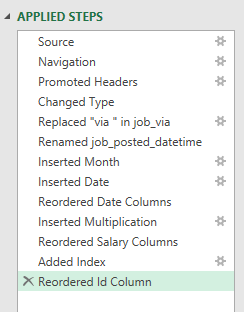
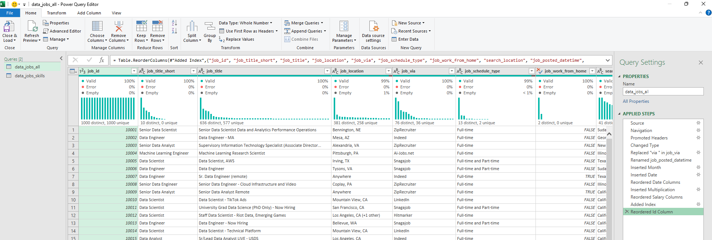

# Data Science Job Market Analysis  

## Introduction  

As a former job seeker, I’ve always been surprised by the lack of data exploring the most optimal jobs and skills in the data science market. I set out to understand what skills top employers request and how to land more pay.  

## Questions to Analyse  

To understand the data science job market, I asked the following:  

1. **Do more skills get you better pay?**  
2. **What’s the salary for data jobs in different regions?**  
3. **What are the top skills of data professionals?**  
4. **What’s the pay for the top 10 skills?**  

## Excel Skills Used  

The following Excel skills were utilized for analysis:  

- **Pivot Tables**    
- **Pivot Charts**    
- **DAX (Data Analysis Expressions)**  
- **Power Query**  
- **Power Pivot**  

## Data Jobs Dataset    

The dataset used for this project contains real-world data science job information from 2023 provided by Luke Barousse(in his Excel course, find in Youtube/ Github) which gives a foundation for analysing data using Excel.    

It includes detailed information on:    

- **Job Titles**    
- **Salaries**    
- **Locations**    
- **Skills**    

## 1) Do More Skills Get You Better Pay?  

###  Skill: Power Query (ETL)  

####  Extract  

- I first used Power Query to extract the original data (`data_salary_all.xlsx`) and create two queries:  
  -  The first query contains all the data jobs information.  
  -  The second query lists the skills associated with each job ID.  

####  Transform  

- I then transformed each query by Changing column data types, Removing unnecessary columns, Cleaning text to eliminate specific words, Trimming excess whitespace.

  - data_jobs_all
     
       

  - data_job_skills
      
  
       
**Load**

 - Finally, I loaded both transformed queries into the workbook, setting the foundation for my subsequent analysis.  
   - data_jobs_all

     
     
   - data_job_skills
  
     

 ## Analysis  
 **Insights**  
  - There is a positive correlation between the number of skills requested in job postings and the median salary, particularly in roles like Senior Data Engineer and Data Scientist.    

  - Roles that require fewer skills, like Business Analyst, tend to offer lower salaries, suggesting that more specialized skill sets command higher market value.

             
